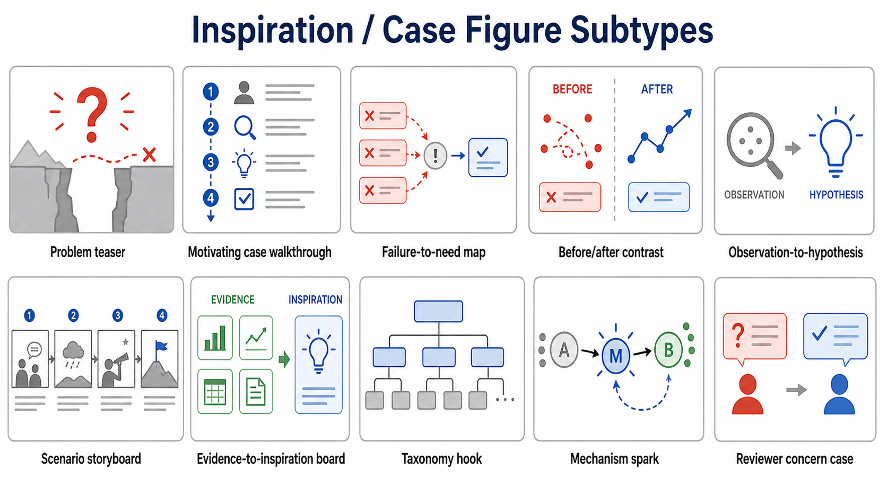
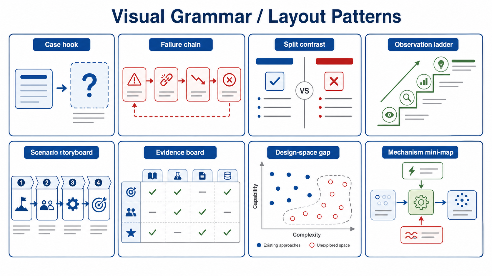
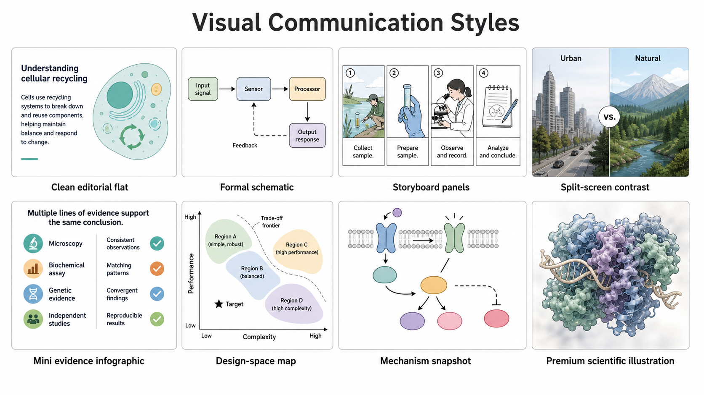
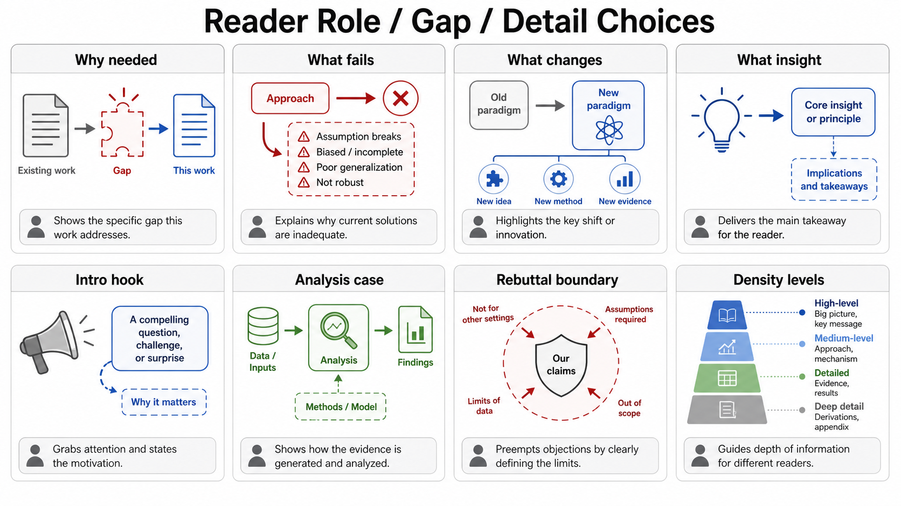
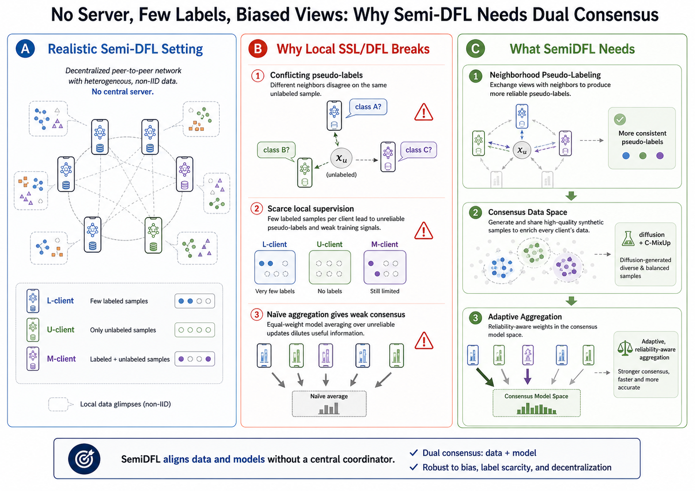
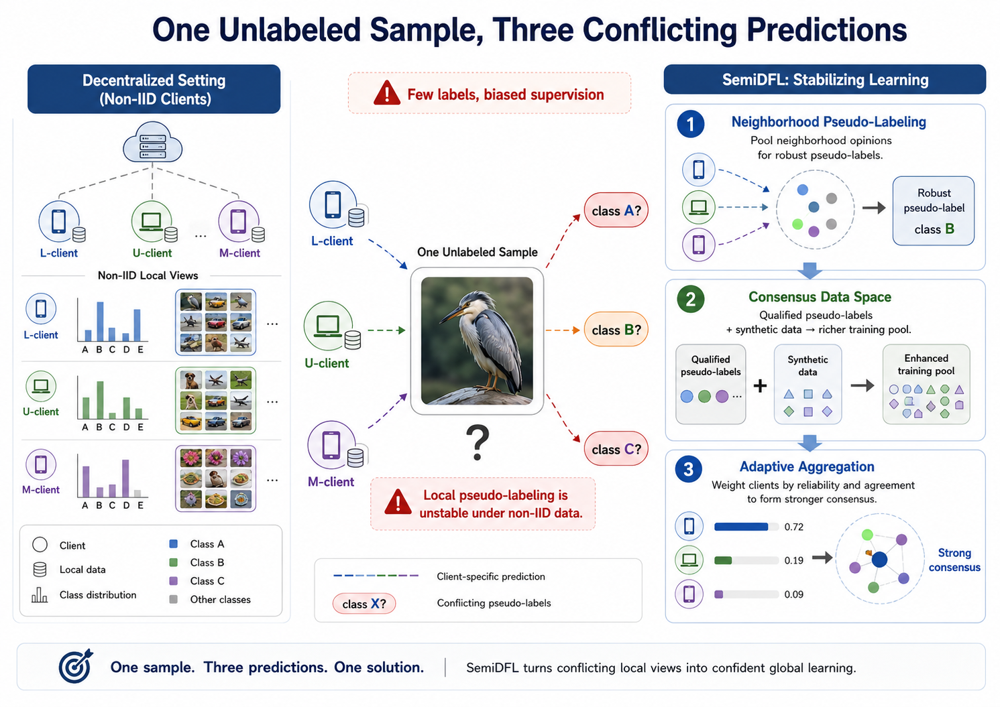
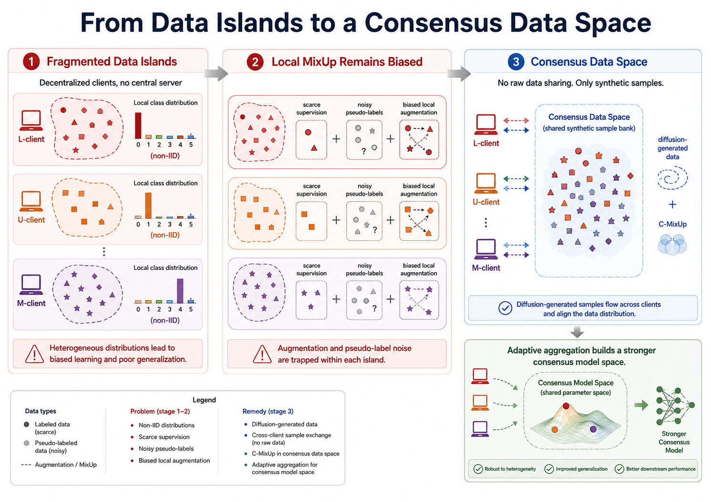
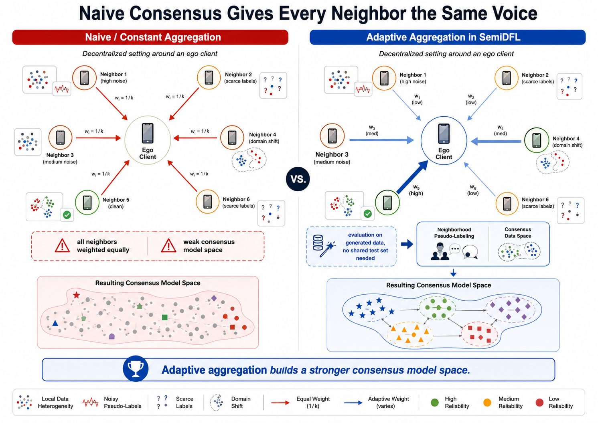
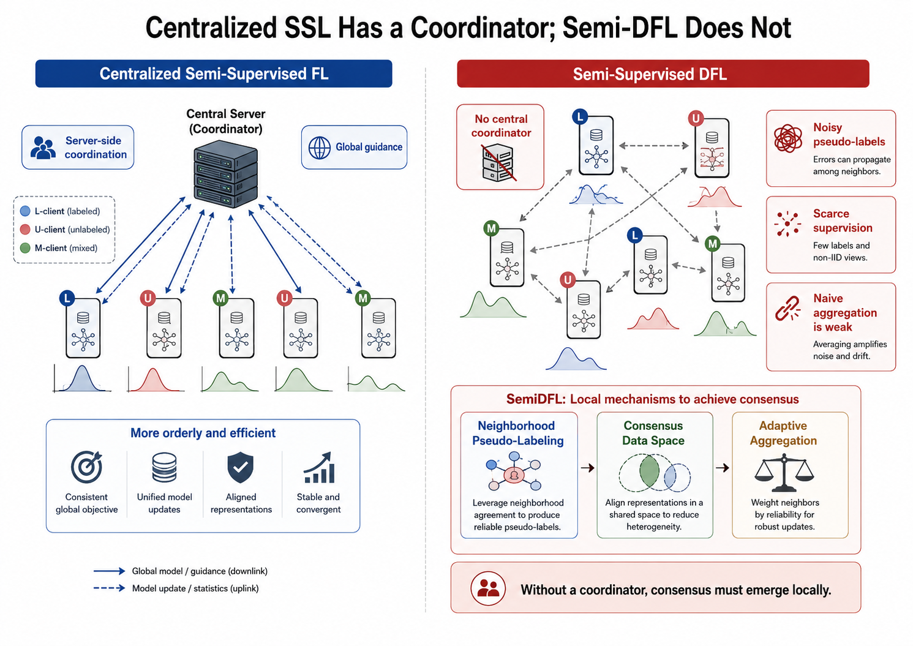
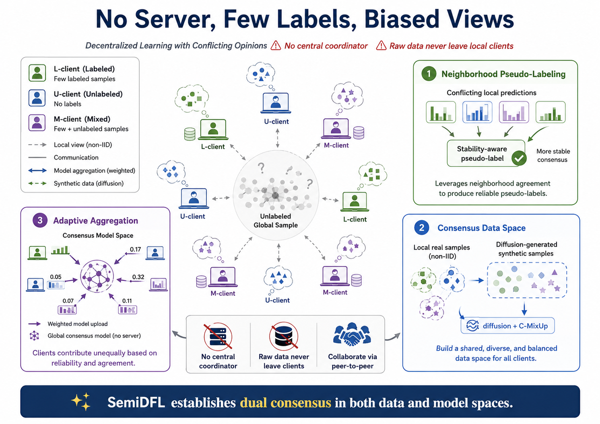

# 论文启发案例图制图 Skill

`inspiration-case-figure-guide` 用于帮助研究者为论文生成 inspiration figure、motivation figure、case figure、problem teaser、failure case、before/after contrast 和 observation-to-hypothesis diagram 等启发案例图。它适合把论文 PDF、摘要、引言、失败案例、方法动机或草稿想法转化为可比较的视觉叙事方案、候选图、修改建议、caption、legend 和正文中的图说明。


上图是 `example_semiDFL/result.png`，是这个示例流程对 SemiDFL 论文设计的用于第一章的启发案例图，感谢 bristol 的刘同学提供的素材。`example_semiDFL/semidfl-chatgpt-example.mhtml` 是在 ChatGPT 网页版执行 `inspiration-case-figure-guide` 的示例页面导出，可作为复现实例参考。

## 中文

它会先展示内置的子类型/风格示意图谱，再进入论文动机理解、案例证据抽取、方案比较和候选图生成流程。它关注的不是“方法结构怎么画”，而是“读者为什么应该相信这篇工作的动机成立”。

### Skill 适合生成的图

- motivating example figure：用一个具体例子展现研究问题或方法必要性。
- problem-teaser figure：放在论文前部，用来快速说明任务痛点、现有方法不足或关键挑战。
- failure or limitation case：展示已有方法在某些场景下的失败模式、边界条件或局限。
- before/after contrast：对比当前状态与理想状态、baseline 与 proposed method、错误结果与改进结果。
- observation-to-hypothesis diagram：把论文里的关键观察转化为研究假设或设计动机。
- scenario storyboard：用连续场景说明问题如何发生、为何难以解决、方法目标是什么。
- evidence-to-inspiration board：把数据、案例、现象和设计启发组织成一张证据驱动的动机图。
- design-space gap figure：展示现有方法覆盖不到的设计空间、任务区域或能力组合。
- mechanism spark figure：在方法细节前，用机制直觉解释核心想法为什么可能有效。
- reviewer concern case：用具体案例澄清审稿人可能质疑的边界、风险或误解。

### 内置示意图谱

首次启动时，skill 会展示已保存的子类型/风格 atlas，不会立刻分析论文，也不会现场生图。这些 atlas 是用来帮助用户和模型对齐图型、布局、读者角色、信息密度和视觉风格的参考板，不等于正式候选图。

skill 包内通常包含以下 atlas 资源：

- `assets/subtype-atlas/boards/subtype-overview.png`：inspiration/case 图型总览。
- `assets/subtype-atlas/boards/visual-grammar-layout.png`：视觉语法和布局方式。
- `assets/subtype-atlas/boards/reader-role-detail.png`：读者问题、论文位置和信息密度选择。
- `assets/subtype-atlas/boards/visual-communication-styles.png`：主要视觉传达风格。
- `assets/subtype-atlas/manifest.json`：atlas 元数据、分类角度、子类别和用途说明。

### Skill 总结出的分类体系

这个 skill 会从多个角度判断一张论文启发案例图应该如何设计，而不是只把图简单归为“动机图”或“案例图”。

- 按图型/叙事角色分类：problem teaser、motivating case walkthrough、failure-to-need map、before/after contrast、observation-to-hypothesis、scenario storyboard、evidence-to-inspiration board、taxonomy hook、mechanism spark、reviewer concern case。
- 按视觉语法/布局分类：case hook、failure chain、split contrast、observation ladder、scenario storyboard、evidence board、design-space gap、mechanism mini-map。
- 按读者问题分类：为什么需要这篇论文、现有方法哪里失败、本文希望改变什么、核心观察或启发是什么、哪个案例最能展现 research gap、审稿人可能质疑的边界在哪里。
- 按论文位置分类：opening figure、introduction figure、motivation figure、method 前置说明图、analysis case、limitation figure、rebuttal case、supplementary case。
- 按动机来源分类：真实案例、失败样例、异常现象、任务冲突、已有方法局限、数据分布差异、用户场景、机制直觉、reviewer 可能质疑的问题。
- 按视觉传达风格分类：clean editorial flat、formal schematic、storyboard panels、split-screen contrast、mini-evidence infographic、design-space map、mechanism snapshot、premium scientific illustration 等。
- 按证据来源分类：evidence board、case walkthrough、mechanism intuition、data/benchmark/protocol、failure/limitation、taxonomy/design-space。
- 按参考图使用方式分类：只参考布局、只参考风格、只参考信息密度、只参考标签组织、只参考配色、只参考 callout 语法、只参考局部案例表达，或作为 negative reference 说明不要借鉴哪些部分。

### SemiDFL 示例文件说明

`example_semiDFL` 目录保存了一个完整的 ChatGPT 网页版制图例子：

- `semidfl-chatgpt-example.mhtml`：在 ChatGPT 网页版执行 `inspiration-case-figure-guide` 的示例记录，也就是完整页面导出。
- `F1.png`、`F2.png`、`F3.png`、`F4l.png`：不同类别的示例图，用于说明 skill 构建时总结出的图型、布局、读者角色和视觉风格。
- `C1.png` 到 `C6.png`：示例流程中生成的 6 张候选图，用于比较不同的视觉叙事、案例组织和信息密度。
- `result.png`：最终选定并整理后的结果图，适合放在论文 introduction、motivation、case study 或方法前置说明附近，作为读者理解问题动机的入口图。

### 不同类别的示例图

`F1-F4` 是 skill 构建时总结出的不同类别示例图，用于帮助理解 inspiration/case figure 的图型、视觉语法、读者角色和风格选择。

| F1 | F2 |
|---|---|
|  |  |

| F3 | F4 |
|---|---|
|  |  |

### ChatGPT 网页版生成的候选图

| Candidate 1 | Candidate 2 | Candidate 3 |
|---|---|---|
|  |  |  |

| Candidate 4 | Candidate 5 | Candidate 6 |
|---|---|---|
|  |  |  |

### 推荐使用方式

优先在 ChatGPT 网页版中使用，并选择 **Extended thinking**。启发案例图需要理解论文动机、读者预期、案例证据和视觉叙事，网页版更适合完成完整的多轮候选图比较和修改。

如果下一步是生成图片，建议在 ChatGPT 网页版中手动选择 **Create image** 模式，再让它继续生成候选图或最终图。ChatGPT 网页版应使用 Create image / ChatGPT Images 2.0。

在 Codex 里也可以使用。Codex 环境会优先使用 `$imagegen`；如果不可用，再使用 ChatGPT Images 2.0 API 或其他批准的生图 API。Codex 更适合整理本地文件、修改 skill、打包、检查 README 或同步安装目录；主要制图流程仍建议放在 ChatGPT 网页版完成。

### ChatGPT 网页版使用步骤

1. 把 `inspiration-case-figure-guide` skill 压缩包放进 ChatGPT 的 Sources。
2. 把论文 PDF、摘要、引言、方法描述、失败案例或已有草稿也放进 Sources。
3. 选择 Extended thinking。
4. 输入类似下面的 prompt：

```text
请严格按照 inspiration-case-figure-guide 里的 workflow，为这篇论文设计一张 inspiration/case figure。请先不要生成图片，先给出启动计划、展示内置 atlas，并说明下一步需要我提供的信息。
```

如果你的论文材料有明确文件名，请把 prompt 中的“这篇论文”替换为实际上传到 Sources 的文件名。

首次回复只会展示启动计划和内置示意图谱，不会分析论文或生成图片。后续当 skill 完成文字方案比较，并提示下一步要生成候选图或最终图时，建议手动切换到 **Create image** 模式后继续。

### 制图流程

1. 提供论文 PDF、摘要、引言片段、关键失败案例、motivating example 或已有草稿。
2. 说明目标图位置：论文首页 teaser、introduction figure、motivation figure、method 前置说明、rebuttal 图，或 supplementary case。
3. 说明是否要避开论文中已有 diagram，以及是否提供参考图。
4. Skill 先给出启动计划，并展示内置 atlas；第一轮不直接生成新图片。
5. Skill 诊断图的核心读者问题：这篇论文为什么必要、现有方法哪里失败、什么案例最能说明问题。
6. 先生成 4-6 个文字候选方向，通常是 6 个。
7. 进入视觉候选板设置，确认每个候选方向的叙事结构、信息密度、参考图属性和图像生成目标。
8. 生成多张候选图或示意图供比较，通常 6 张。
9. 从候选图中选择最接近的一张，或指出需要保留、删除、强化和重画的部分。
10. 根据选择继续生成正式图或修订图。
11. 最后整理 caption、legend、正文图说明和必要的 reviewer-facing 解释文本。

### 使用时的交互规则

- 每次文本回复都会给出当前步骤、当前状态、已生成产物和下一步建议。
- 如果用户没有按照推荐 prompt 提问，skill 也会先理解用户的真实意图，执行可执行的部分，再把结果映射回原流程中的步骤。
- 图中的案例、数据、失败现象和结论必须来自论文材料本身；如果证据不足，skill 应该标注为待确认，而不是编造视觉事实。
- 文字回复和现场生图不能在同一轮完成。文字回复可以展示已保存的 atlas 图，但不能同时调用 Create image、`$imagegen` 或图像 API。
- 出现多个方案、布局、风格或 prompt 选项时，下一步会优先建议生成多张候选图或示意图供比较，而不是只让用户从文字方案里选。

## English

`inspiration-case-figure-guide` helps researchers create inspiration figures, motivation figures, case figures, problem teasers, failure cases, before/after contrasts, and observation-to-hypothesis diagrams for research papers. It turns a paper PDF, abstract, introduction, motivating case, failure example, method motivation, or draft notes into comparable visual narrative directions, candidate figures, revision guidance, captions, legends, and in-paper figure descriptions.


The image near the top of this README is `example_semiDFL/result.png`, the final inspiration/case figure from the included SemiDFL example. `example_semiDFL/semidfl-chatgpt-example.mhtml` is the exported ChatGPT web example run of `inspiration-case-figure-guide`.

It first shows a saved subtype/style atlas, then proceeds through motivation understanding, case-evidence extraction, direction comparison, and candidate image generation. Its focus is not only how to draw a method structure, but how to help readers understand why the paper's motivation is credible.

### Included SemiDFL Example

The `example_semiDFL` folder contains one complete ChatGPT web figure-making example:

- `semidfl-chatgpt-example.mhtml`: the exported page from an example run of `inspiration-case-figure-guide` in ChatGPT web.
- `F1.png`, `F2.png`, `F3.png`, and `F4l.png`: category example figures showing figure types, layout patterns, reader roles, and visual styles.
- `C1.png` to `C6.png`: six candidate figures generated during the example workflow.
- `result.png`: the selected and polished final result figure.

### Category Example Figures

`F1-F4` are category example figures summarized while building the skill. They help explain the figure-type, visual-grammar, reader-role, and style choices for inspiration/case figures.

| F1 | F2 |
|---|---|
|  |  |

| F3 | F4 |
|---|---|
|  |  |

### Candidate Figures Generated in ChatGPT Web

| Candidate 1 | Candidate 2 | Candidate 3 |
|---|---|---|
|  |  |  |

| Candidate 4 | Candidate 5 | Candidate 6 |
|---|---|---|
|  |  |  |

### Figure Types

- Motivating example figure: a concrete case that shows the research gap.
- Problem-teaser figure: an opening visual hook for a task pain point, method limitation, or key challenge.
- Failure or limitation case: a concrete failure mode, boundary condition, or limitation of existing methods.
- Before/after contrast: current state versus target state, baseline versus proposed method, or wrong result versus improved result.
- Observation-to-hypothesis diagram: a key observation turned into a research hypothesis or design motivation.
- Scenario storyboard: a sequence of scenes explaining how the problem happens and why it is hard.
- Evidence-to-inspiration board: evidence, cases, observations, and design inspiration organized around a motivation claim.
- Design-space gap figure: a missing region in an existing design space, task space, or capability combination.
- Mechanism spark figure: a mechanism intuition before detailed method explanation.
- Reviewer concern case: a boundary case that clarifies a likely reviewer concern or misunderstanding.

### Built-In Atlas

On first startup, the skill displays saved subtype/style atlas boards. It does not immediately analyze the paper or generate new images. These boards help align the figure type, layout, reader role, information density, and visual style before live candidate generation.

The skill package usually contains these atlas resources:

- `assets/subtype-atlas/boards/subtype-overview.png`: overview of inspiration/case figure subtypes.
- `assets/subtype-atlas/boards/visual-grammar-layout.png`: visual grammar and layout patterns.
- `assets/subtype-atlas/boards/reader-role-detail.png`: reader question, paper slot, and density/detail choices.
- `assets/subtype-atlas/boards/visual-communication-styles.png`: major visual communication styles.
- `assets/subtype-atlas/manifest.json`: atlas metadata, category axes, subtypes, and intended usage.

### Classification Axes Summarized by the Skill

The skill classifies inspiration/case figures from multiple angles instead of treating every output as a generic motivation figure or case diagram.

- By figure and narrative role: problem teaser, motivating case walkthrough, failure-to-need map, before/after contrast, observation-to-hypothesis, scenario storyboard, evidence-to-inspiration board, taxonomy hook, mechanism spark, reviewer concern case.
- By visual grammar and layout: case hook, failure chain, split contrast, observation ladder, scenario storyboard, evidence board, design-space gap, mechanism mini-map.
- By reader question: why the paper is needed, what fails in existing methods, what the paper wants to change, what the key insight is, which case best shows the research gap, and what boundary reviewers may question.
- By paper slot: opening figure, introduction figure, motivation figure, pre-method explanation, analysis case, limitation figure, rebuttal case, supplementary case.
- By motivation source: concrete case, failure example, abnormal observation, task conflict, method limitation, distribution shift, user scenario, mechanism intuition, and reviewer concern.
- By visual communication style: clean editorial flat, formal schematic, storyboard panels, split-screen contrast, mini-evidence infographic, design-space map, mechanism snapshot, premium scientific illustration, and related styles.
- By evidence source: evidence board, case walkthrough, mechanism intuition, data/benchmark/protocol, failure/limitation, and taxonomy/design-space.
- By reference-image usage: layout only, style only, information density only, label organization only, color only, callout grammar only, local case expression only, or negative reference.

### Recommended Use

Prefer using this skill in the ChatGPT web app with **Extended thinking** enabled. Inspiration and case figures depend on paper motivation, reader expectations, case evidence, and visual narrative, so the full workflow benefits from multi-turn reasoning and candidate comparison.

If the next step is image generation, manually switch to **Create image** mode in ChatGPT web before asking it to generate candidate figures or the final figure. ChatGPT web should use Create image / ChatGPT Images 2.0.

You can also use it in Codex. Codex should use `$imagegen` first; if unavailable, it should use ChatGPT Images 2.0 API or another approved image-generation API. Codex is best for local file organization, skill editing, packaging, README updates, and installation checks. The main figure-making workflow is usually better in ChatGPT web.

### ChatGPT Web Usage

1. Add the `inspiration-case-figure-guide` skill package to ChatGPT Sources.
2. Add the paper PDF, abstract, introduction excerpt, method notes, failure case, or draft figure notes to Sources.
3. Select Extended thinking.
4. Type a prompt like this:

```text
Please strictly follow the workflow in inspiration-case-figure-guide to design an inspiration/case figure for this paper. Do not generate images yet; first provide the startup plan, display the built-in atlas, and ask for the next required input.
```

If the paper material has a specific file name, replace "this paper" with the exact file name uploaded to Sources.

The first reply only shows the startup plan and saved atlas boards. It does not analyze the paper or generate images. When the skill has finished comparing text directions and the next step is to generate candidate figures or a final figure, switch to **Create image** mode before continuing.

### Figure-Making Workflow

1. Provide the paper PDF, abstract, introduction excerpt, motivating case, failure example, or draft notes.
2. Specify the target figure slot: first-page teaser, introduction figure, motivation figure, pre-method explanation, rebuttal figure, or supplementary case.
3. Specify whether existing diagrams in the paper should be ignored and whether reference images are provided.
4. The skill starts with a text-only startup plan and displays the built-in atlas; it does not generate new images in the first reply.
5. It diagnoses the core reader question: why the paper is necessary, where existing methods fail, and which case best shows the problem.
6. It first proposes 4-6 text directions, usually 6.
7. It sets up a visual candidate board with narrative structure, information density, reference-image attributes, and image-generation goals.
8. It generates multiple candidate figures or schematic candidates, usually 6.
9. You select the closest candidate or describe what should be kept, removed, strengthened, or redrawn.
10. It then generates a formal figure or revised figure based on the selected direction.
11. It finally drafts the caption, legend, in-paper figure description, and reviewer-facing explanation when needed.

### Interaction Rules

- Every text reply reports the current step, current state, produced artifacts, and recommended next question.
- If the user does not follow the recommended prompt, the skill still interprets the request, performs the valid part, and maps the result back to the original workflow step.
- Cases, data, failure observations, and conclusions in the final figure must come from the paper material itself. If evidence is missing, the skill should mark it as needing confirmation instead of inventing visual facts.
- Text replies and live image generation cannot happen in the same response. Text replies may show saved atlas boards, but they must not call Create image, `$imagegen`, or an image API in the same turn.
- Whenever multiple schemes, layouts, styles, or prompt options are presented, the next step should prioritize generating multiple candidate images or schematic candidates for visual comparison.
