# 论文启发案例图制图 Skill

`inspiration-case-figure-guide` 是一个面向研究论文启发图、动机图和案例图的专项制图 skill，适合制作 inspiration figure、motivation figure、case figure、problem teaser、failure case、before/after contrast 和 observation-to-hypothesis diagram。它会把论文 PDF、摘要、引言、失败案例、方法动机或草稿想法转化为可比较的视觉叙事方案、候选图、二轮优化方向、修改建议、caption、legend 和正文中的图说明。

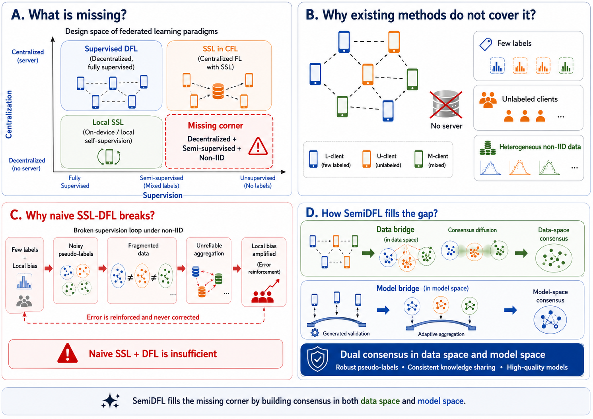

上图是 `example_semiDFL/result.png`，是本仓库随附 SemiDFL 示例流程得到的最终启发案例图，可用于论文 introduction、motivation、case study 或方法前置说明附近。这里特别感谢 Bristol 的刘欣阳同学提供素材支持， semiDFL.pdf是示例中的文献，有兴趣的可以使用其按照例子运行一遍。`example_semiDFL/semidfl-chatgpt-example.mhtml` 是 ChatGPT 网页版执行记录导出，`example_semiDFL/semi_codex_v.mp4` 是 Codex 版使用片段，二者可作为完整流程参考。

当前版本V5.0.0由 `research-paper-figure-skill-factory` 生成，核心规则是：启动只给计划和内置参考图谱；目标论文候选图、二轮变体图、正式图和修订图必须放在独立 `IMAGE_ONLY` 步骤中；第一轮候选图强调方向多样性；选出第一轮当前最佳方向后，必须经过二轮局部优化再进入最终 prompt 或正式生成。

## 适合的任务

- 把论文 PDF、摘要、引言片段、失败案例、motivating example 或草稿想法转成可比较的启发/动机/案例图方案。
- 为 problem teaser、motivation figure、failure case、before/after contrast、observation-to-hypothesis diagram、scenario storyboard 或 reviewer concern case 生成候选图。
- 比较不同图型、视觉语法、案例组织、信息密度、读者理解路径和视觉风格。
- 从多张候选图中选择方向，再围绕证据锚点、标签经济性、panel 过渡、颜色语义、callout 位置和审稿可读性做二轮优化。
- 生成正式图 prompt、修订建议、caption、legend、正文图说明和 reviewer-facing 解释文本。

## 关键规则

- **启动只给计划**：首次触发时只展示启动计划和已保存的 subtype/style atlas，不分析目标论文，不生成目标论文图像。
- **目标论文图像隔离**：目标论文候选图、二轮变体图、草稿图、正式图、最终图和修订图必须在 `IMAGE_ONLY` 步骤中输出，不能嵌入普通文本回复。
- **第一轮要多样**：第一轮候选图用于搭建方向，通常生成 4-6 张，重点变化图型、叙事结构、案例组织、信息密度、panel rhythm 和 style family。
- **第二轮做局部优化**：选出第一轮当前最佳方向后，必须围绕目标论文的局部证据、失败案例、标签、颜色、callout 和读者问题继续生成二轮变体。
- **证据必须来自材料**：图中的案例、数据、失败现象和结论必须来自论文材料本身；如果证据不足，skill 应标注为待确认，而不是编造视觉事实。
- **自由提问也要对齐状态**：即使用户直接说“继续”“出图”“改得更简洁”，skill 也要判断请求对应的流程步骤，记录当前状态和下一步建议。

## 内置参考图谱

skill 包内包含保存好的 subtype/style atlas。启动和后续抽象视觉决策中，skill 会用 Markdown 图片嵌入展示相关参考图，而不是只列路径。

本仓库的 `example_semiDFL` 目录保留了对应示例图谱：

| Subtype Overview | Visual Grammar |
|---|---|
| 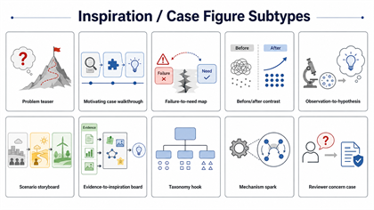 | 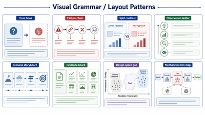 |

| Reader Role | Visual Styles |
|---|---|
| 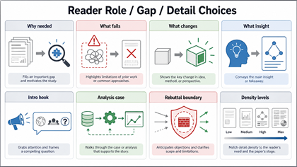 | 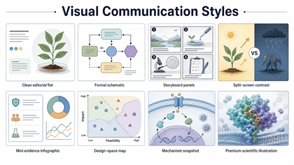 |

| Second-Round Optimization |
|---|
| 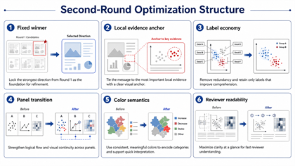 |

- `subtype-overview.png`：inspiration/case 图型总览。
- `visual-grammar-layout.png`：视觉语法和布局方式。
- `reader-role-detail.png`：读者问题、论文位置和信息密度选择。
- `visual-communication-styles.png`：主要视觉传达风格。
- `second-round-optimization-structure.png`：第一轮方向锁定后的二轮局部优化结构。

这些图是参考/概念图，不是某篇目标论文的候选图，也不能替代正式候选图生成步骤。

## SemiDFL 示例文件

`example_semiDFL` 目录保存了一个完整 ChatGPT 网页版制图例子，并补充了 Codex 使用片段：

- `semidfl-chatgpt-example.mhtml`：ChatGPT 网页版执行 `inspiration-case-figure-guide` 的示例记录，也就是完整页面导出。
- `semi_codex_v.mp4`：Codex 环境中使用该 skill 的示例片段。
- `subtype-overview.png`、`visual-grammar-layout.png`、`reader-role-detail.png`、`visual-communication-styles.png`、`second-round-optimization-structure.png`：构建 skill 时总结出的图型、布局、读者角色、视觉风格和二轮优化参考图。
- `R1C1.png` 到 `R1C6.png`：第一轮生成的 6 张目标论文候选图，用于比较多样化方向。`R1C*` 表示 round 1 candidate。
- `R2C1.png` 到 `R2C4.png`：第二轮生成的目标论文候选图，用于围绕第一轮选定方向做局部优化和再选择。`R2C*` 表示 round 2 candidate。
- `result.png`：最终选定并整理后的启发案例图。

第一轮候选图示例（R1C*）：

| R1C1 | R1C2 | R1C3 |
|---|---|---|
| 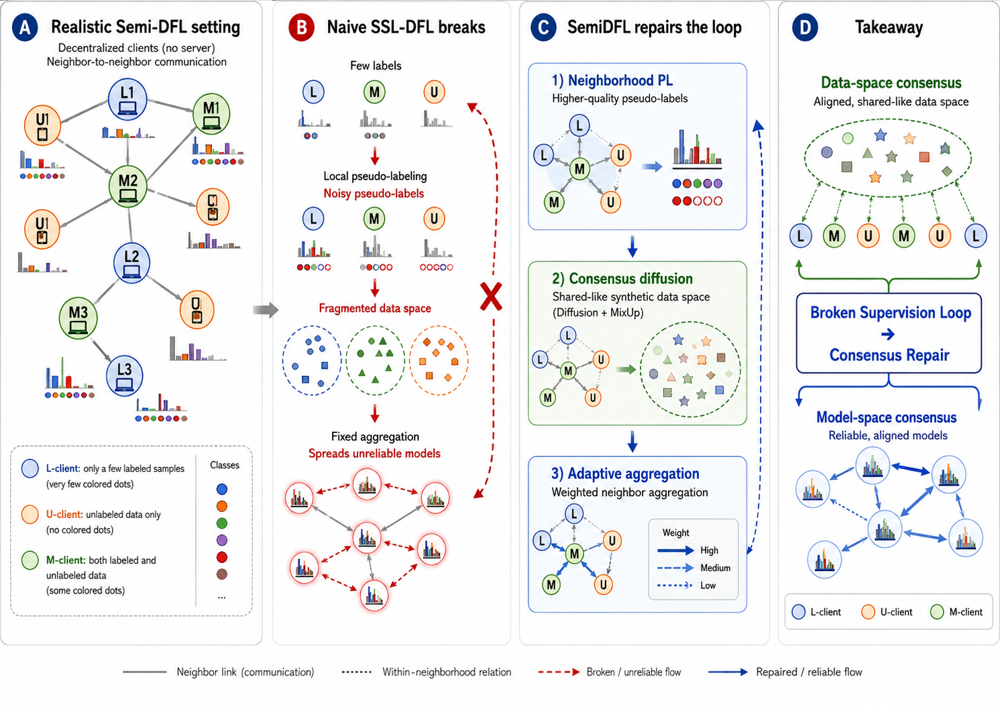 | 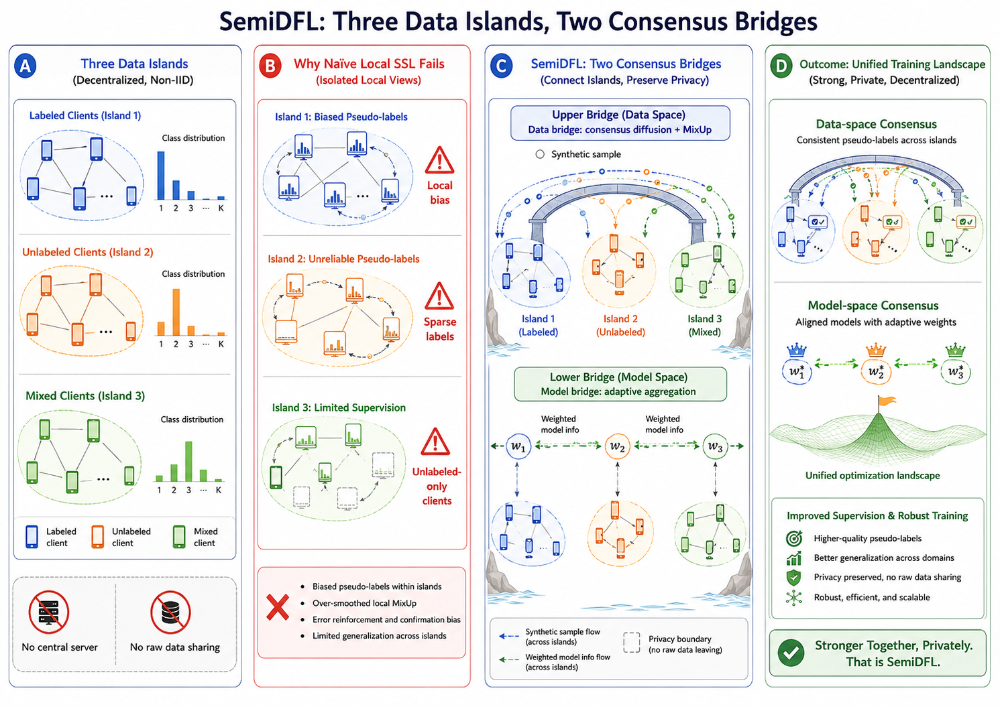 | 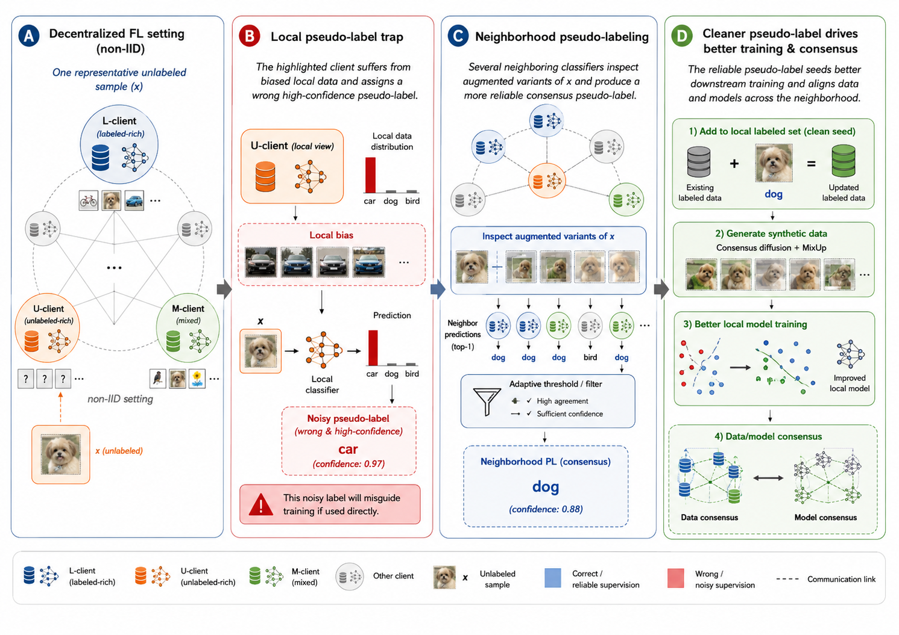 |

| R1C4 | R1C5 | R1C6 |
|---|---|---|
| 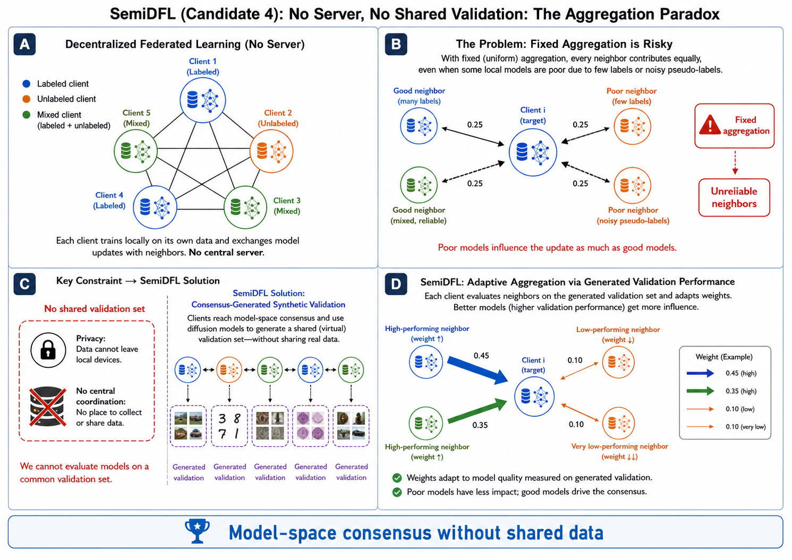 | 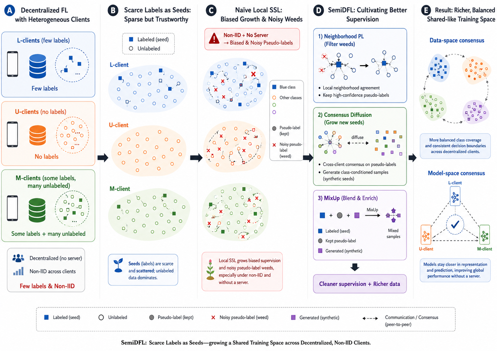 | 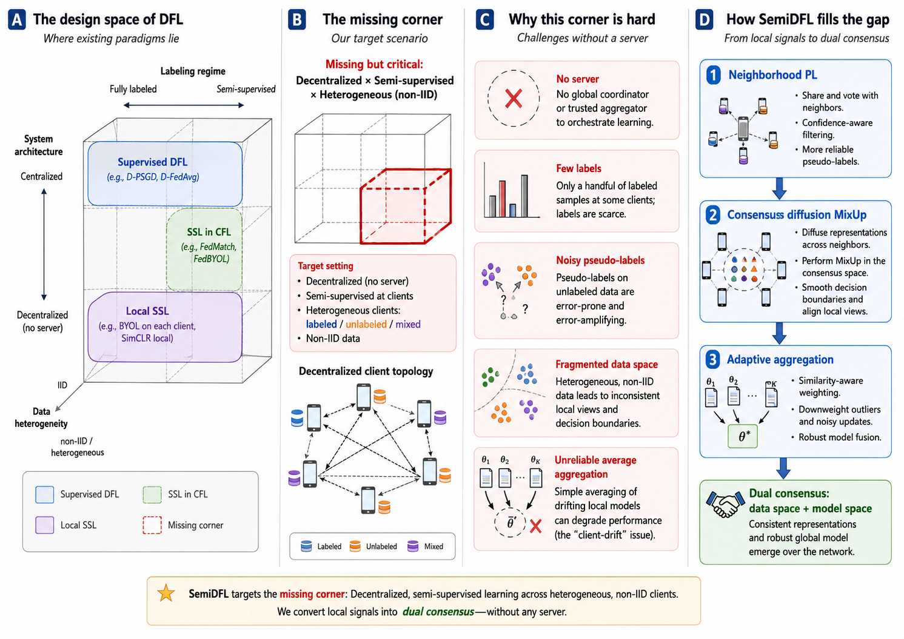 |

第二轮候选图示例（R2C*）：

| R2C1 | R2C2 |
|---|---|
| 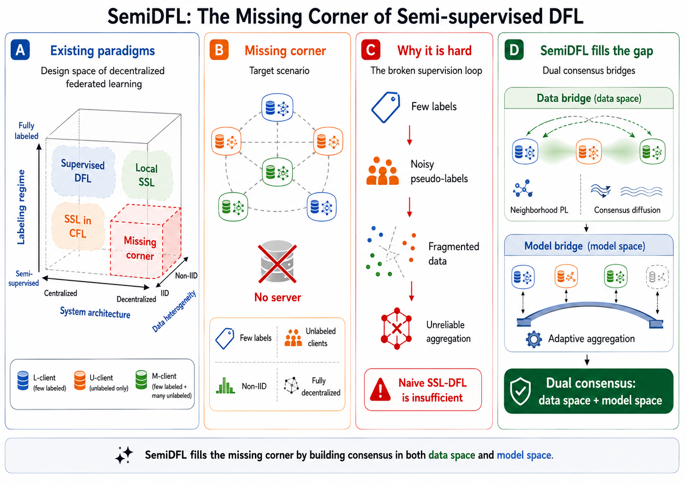 | 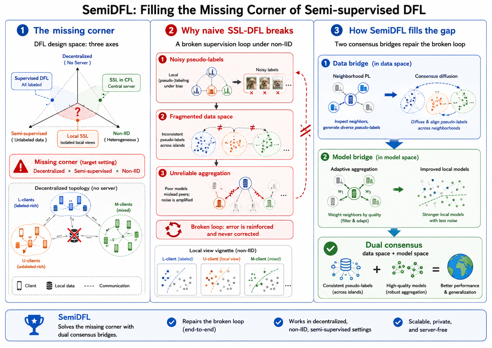 |

| R2C3 | R2C4 |
|---|---|
| 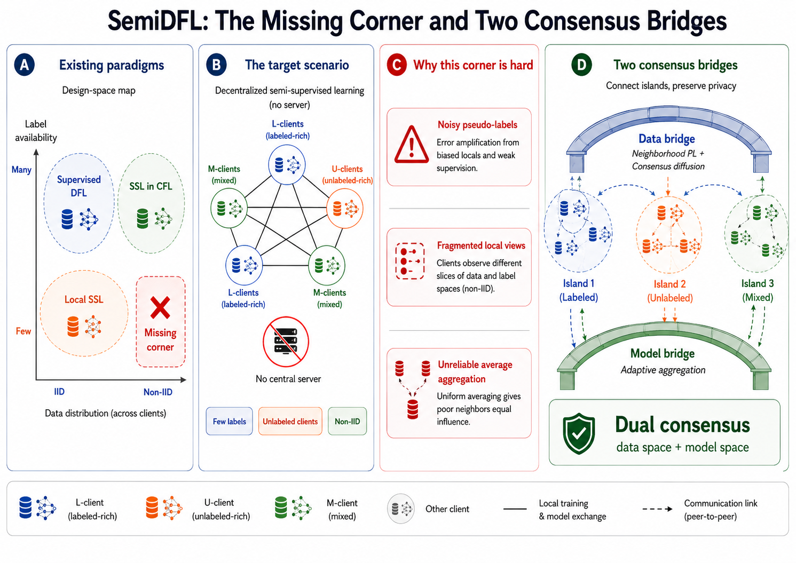 | 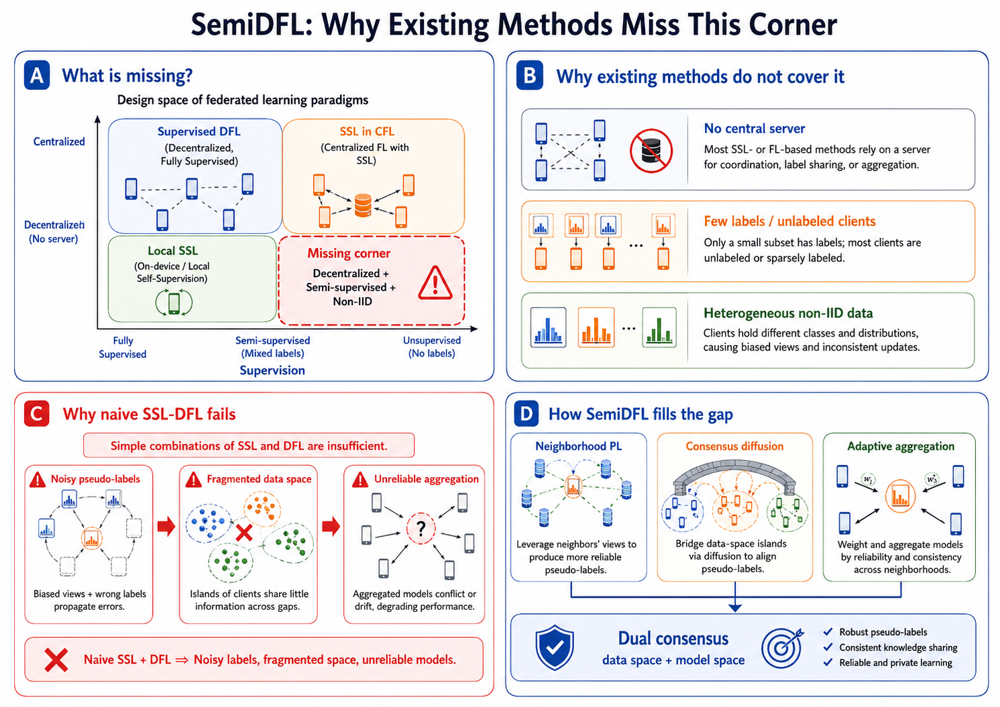 |

## Skill 总结出的分类体系

这个 skill 会从多个角度判断一张论文启发案例图应该如何设计，而不是只把图简单归为“动机图”或“案例图”。

- 按图型/叙事角色分类：problem teaser、motivating case walkthrough、failure-to-need map、before/after contrast、observation-to-hypothesis、scenario storyboard、evidence-to-inspiration board、taxonomy hook、mechanism spark、reviewer concern case。
- 按视觉语法/布局分类：case hook、failure chain、split contrast、observation ladder、scenario storyboard、evidence board、design-space gap、mechanism mini-map。
- 按读者问题分类：为什么需要这篇论文、现有方法哪里失败、本文希望改变什么、核心观察或启发是什么、哪个案例最能展现 research gap、审稿人可能质疑的边界在哪里。
- 按论文位置分类：opening figure、introduction figure、motivation figure、method 前置说明图、analysis case、limitation figure、rebuttal case、supplementary case。
- 按动机来源分类：真实案例、失败样例、异常现象、任务冲突、已有方法局限、数据分布差异、用户场景、机制直觉、reviewer 可能质疑的问题。
- 按视觉传达风格分类：clean editorial flat、formal schematic、storyboard panels、split-screen contrast、mini-evidence infographic、design-space map、mechanism snapshot、premium scientific illustration 等。
- 按证据来源分类：evidence board、case walkthrough、mechanism intuition、data/benchmark/protocol、failure/limitation、taxonomy/design-space。
- 按参考图使用方式分类：只参考布局、只参考风格、只参考信息密度、只参考标签组织、只参考配色、只参考 callout 语法、只参考局部案例表达，或作为 negative reference 说明不要借鉴哪些部分。

## 工作流

1. **S0 启动**：只显示启动计划和保存的 atlas，不分析目标论文，不生成目标论文图。
2. **P1 材料导入**：读取论文 PDF、摘要、引言、失败案例、目标章节、草图、参考图或用户约束。
3. **P2 图需求诊断**：判断读者问题、论文位置、叙事功能和候选图类型，并展示相关参考/概念/结构图。
4. **P3 文本候选**：提出 4-6 个文字方案，通常 6 个。
5. **P4 第一轮候选图设置**：定义候选图数量、多样化轴、固定内容、渲染路线和比较标准。
6. **P5 第一轮候选图**：`IMAGE_ONLY` 生成或展示 4-6 张目标论文候选图，通常 6 张，强调方向多样性。
7. **P6 第一轮复盘**：记录第一轮 image batch，比较候选图，选出当前最佳方向，但不能直接进入最终 prompt。
8. **P6b 二轮优化设置**：从论文局部细节和最佳实践提出 4-6 个优化轴。
9. **P6b-IMAGE 二轮变体图**：`IMAGE_ONLY` 生成或展示目标论文二轮变体图，使用新的 `second_round_candidate_batch_id`。
10. **P6c 二轮选择**：记录二轮 batch，比较变体，锁定或组合最终方向。
11. **P7 最终图 brief / prompt**：在 P6c 后构建正式图像 prompt 和版面要求。
12. **P8 正式生成/修订**：`IMAGE_ONLY` 生成正式图或修订图。
13. **P9 审稿式检查与整合**：输出 critique、caption、legend、正文引用文本和修改建议。

## 推荐使用方式

如果token资源优先，则优先建议在ChatGPT 网页版中使用，并选择 **Extended thinking**。启发案例图需要理解论文动机、读者预期、案例证据和视觉叙事。

当下一步是图像生成时，在 ChatGPT 网页版中手动选择 **Create image** 模式，再让 skill 继续生成候选图、二轮变体图、正式图或修订图。ChatGPT 网页版应使用 Create image / ChatGPT Images 2.0。

在 Codex 中也可以使用该 skill。Codex 应优先使用 `$imagegen`，不可用时再使用 ChatGPT Images 2.0 API 或其他批准的图像生成 API。Codex 更适合整理本地文件、检查 README、更新 skill、打包和安装。

## ChatGPT 网页版使用步骤

1. 将 `inspiration-case-figure-guide-v5.0.0-skill.zip` 放入 ChatGPT Sources。
2. 将目标论文 PDF、摘要、引言、失败案例或草稿说明也放入 Sources。
3. 选择 Extended thinking。
4. 输入类似下面的 prompt：

```text
请严格按照 inspiration-case-figure-guide-v5.0.0-skill.zip 里的 workflow，为这篇论文设计一张 inspiration/case figure。请先不要生成图片，先给出启动计划、展示内置 atlas，并说明下一步需要我提供的信息。
```

如果你的论文材料有明确文件名，请把 prompt 中的“这篇论文”替换为实际上传到 Sources 的文件名。

首次回复只会展示启动计划和内置示意图谱，不会分析论文或生成目标论文图像。后续当 skill 完成文字方案比较，并提示下一步需要生成候选图、二轮变体图或最终图时，再切换到 **Create image** 模式继续。

## Codex 使用示例

可以在 Codex 工程目录中使用压缩包形式的 skill。把 `inspiration-case-figure-guide-v5.0.0-skill.zip` 放在工程目录下，大模型推荐使用 GPT-5.5，并确认目标论文 PDF 也在同一工程目录中，或在 prompt 里写清楚 PDF 的相对路径。Codex 里使用可能会消耗较多 token，额度不高情况下建议使用 ChatGPT 网页版方式。

示例 prompt：

```text
请为一个 agent 配置 inspiration-case-figure-guide-v5.0.0-skill.zip 里的 skill，然后严格按照 skill 的步骤，对目标论文绘制 inspiration/case figure。请先不要生成图片，先展示启动计划和内置 atlas；后续生成候选图时，第一轮用 R1C* 记录多样化方向，第二轮用 R2C* 记录围绕选定方向的局部优化变体。
```

如果目标论文已经有图，可以补充说明是否要避开已有 diagram。这里的“避开已有 diagram”指的是避免把论文原图作为先验模板；它不禁止 skill 根据论文内容独立构思出相似的信息结构或视觉组织。

## 使用时的交互规则

- 每次文本回复都会报告当前步骤、当前状态、已生成产物和下一步建议。
- 文本回复可以嵌入已保存 atlas、参考图、非目标概念图或建模示例图。
- 文本回复不能嵌入目标论文候选图、二轮变体图、正式图、最终图或修订图。
- 文字回复和现场生图不能在同一轮完成。文字回复可以展示已保存的 atlas 图，但不能同时调用 Create image、`$imagegen` 或图像 API。
- 多个文本方案之后，下一步应优先生成多张候选图进行视觉比较，而不是只让用户从文字方案中锁定方向。
- P6 选出第一轮当前最佳方向后，默认必须继续做 P6b / P6b-IMAGE / P6c 二轮优化选择。

## English

`inspiration-case-figure-guide` is a specialized figure-making skill for research-paper inspiration, motivation, and case figures. It is designed for inspiration figures, motivation figures, case figures, problem teasers, failure cases, before/after contrasts, and observation-to-hypothesis diagrams. It turns a paper PDF, abstract, introduction, failure case, method motivation, or draft notes into comparable visual narrative directions, candidate figures, second-round optimization variants, revision guidance, captions, legends, and in-paper figure descriptions.


The image above is `example_semiDFL/result.png`, the final inspiration/case figure from the included SemiDFL example workflow. It can be used near an introduction, motivation section, case study, or pre-method explanation. Special thanks to Xinyang Liu from Bristol for providing the supporting materials. `semiDFL.pdf` is the paper used in the example; interested users can run through the example with it. `example_semiDFL/semidfl-chatgpt-example.mhtml` is the exported ChatGPT web execution record, and `example_semiDFL/semi_codex_v.mp4` is a Codex usage clip; together they serve as workflow references.

Current version V5.0.0 was generated by `research-paper-figure-skill-factory`, and its core rules are: startup-only first replies, saved atlas display, strict `IMAGE_ONLY` isolation for target-paper images, diverse first-round candidate boards, and mandatory second-round local optimization before final prompt construction or formal image generation.

### Suitable Tasks

- Turn a paper PDF, abstract, introduction excerpt, failure case, motivating example, or draft note into comparable inspiration/motivation/case figure directions.
- Generate candidate figures for problem teasers, motivation figures, failure cases, before/after contrasts, observation-to-hypothesis diagrams, scenario storyboards, and reviewer concern cases.
- Compare figure types, visual grammars, case organization, information density, reader-comprehension paths, and visual styles.
- Select a direction from multiple candidate figures, then run second-round optimization around evidence anchors, label economy, panel transitions, color semantics, callouts, and reviewer readability.
- Produce final image prompts, revision notes, captions, legends, in-paper figure descriptions, and reviewer-facing explanations.

### Key Rules

- **Startup plan only**: the first response shows only the startup plan and saved subtype/style atlas. It does not analyze the target paper or generate target-paper images.
- **Target-paper image isolation**: target-paper candidate figures, second-round variants, drafts, formal figures, final figures, and revisions must be output in `IMAGE_ONLY` steps.
- **Diverse first round**: the first candidate round usually generates 4-6 figures and varies figure type, narrative structure, case organization, density, panel rhythm, and style family.
- **Local second round**: after selecting the current best first-round direction, the workflow must continue with second-round variants around paper-local evidence, failure cases, labels, colors, callouts, and reader questions.
- **Evidence must come from materials**: cases, data, failure observations, and conclusions in the final figure must come from the paper materials. If evidence is missing, the skill should mark it as needing confirmation instead of inventing visual facts.
- **Free-form requests must still align with state**: even if the user says only "continue," "generate the figure," or "make it simpler," the skill must identify the corresponding workflow step, record the state, and suggest the next step.

### Built-In Reference Atlas

The skill package includes a saved subtype/style atlas. During startup and later abstract visual decisions, the skill embeds relevant reference images with Markdown instead of only listing file paths.

The `example_semiDFL` directory keeps the corresponding atlas examples:

| Subtype Overview | Visual Grammar |
|---|---|
|  |  |

| Reader Role | Visual Styles |
|---|---|
|  |  |

| Second-Round Optimization |
|---|
|  |

- `subtype-overview.png`: overview of inspiration/case figure subtypes.
- `visual-grammar-layout.png`: visual grammar and layout patterns.
- `reader-role-detail.png`: reader question, paper slot, and density/detail choices.
- `visual-communication-styles.png`: major visual communication styles.
- `second-round-optimization-structure.png`: second-round local optimization structure after the first-round direction is selected.

These are reference/concept images, not candidate figures for a target paper, and they do not replace the formal candidate-generation steps.

### SemiDFL Example Files

The `example_semiDFL` directory preserves a complete ChatGPT web figure-making example and a Codex usage clip:

- `semidfl-chatgpt-example.mhtml`: exported ChatGPT web execution record for `inspiration-case-figure-guide`.
- `semi_codex_v.mp4`: a Codex usage clip for this skill.
- `subtype-overview.png`, `visual-grammar-layout.png`, `reader-role-detail.png`, `visual-communication-styles.png`, and `second-round-optimization-structure.png`: figure-type, layout, reader-role, visual-style, and second-round optimization references summarized while building the skill.
- `R1C1.png` to `R1C6.png`: 6 first-round target-paper candidate figures for comparing diverse directions. `R1C*` means round 1 candidate.
- `R2C1.png` to `R2C4.png`: second-round target-paper candidate figures for local optimization around the selected first-round direction. `R2C*` means round 2 candidate.
- `result.png`: final selected and organized inspiration/case figure.

First-round candidate examples (R1C*):

| R1C1 | R1C2 | R1C3 |
|---|---|---|
|  |  |  |

| R1C4 | R1C5 | R1C6 |
|---|---|---|
|  |  |  |

Second-round candidate examples (R2C*):

| R2C1 | R2C2 |
|---|---|
|  |  |

| R2C3 | R2C4 |
|---|---|
|  |  |

### Classification Axes Summarized by the Skill

The skill classifies inspiration/case figures from multiple angles instead of treating every output as a generic motivation figure or case diagram.

- By figure and narrative role: problem teaser, motivating case walkthrough, failure-to-need map, before/after contrast, observation-to-hypothesis, scenario storyboard, evidence-to-inspiration board, taxonomy hook, mechanism spark, reviewer concern case.
- By visual grammar and layout: case hook, failure chain, split contrast, observation ladder, scenario storyboard, evidence board, design-space gap, mechanism mini-map.
- By reader question: why the paper is needed, what fails in existing methods, what the paper wants to change, what the key insight is, which case best shows the research gap, and what boundary reviewers may question.
- By paper slot: opening figure, introduction figure, motivation figure, pre-method explanation, analysis case, limitation figure, rebuttal case, supplementary case.
- By motivation source: concrete case, failure example, abnormal observation, task conflict, method limitation, distribution shift, user scenario, mechanism intuition, and reviewer concern.
- By visual communication style: clean editorial flat, formal schematic, storyboard panels, split-screen contrast, mini-evidence infographic, design-space map, mechanism snapshot, premium scientific illustration, and related styles.
- By evidence source: evidence board, case walkthrough, mechanism intuition, data/benchmark/protocol, failure/limitation, and taxonomy/design-space.
- By reference-image usage: layout only, style only, information density only, label organization only, color only, callout grammar only, local case expression only, or negative reference.

### Workflow

1. **S0 startup**: show only the startup plan and saved atlas; do not analyze the target paper or generate target-paper images.
2. **P1 material intake**: read the paper PDF, abstract, introduction, failure case, target sections, sketches, references, or user constraints.
3. **P2 figure-need diagnosis**: identify the reader question, paper slot, narrative role, and candidate figure types, with relevant reference/concept/structure images.
4. **P3 text candidates**: propose 4-6 text directions, usually 6.
5. **P4 first-round candidate setup**: define candidate count, diversity axes, fixed content, rendering route, and comparison criteria.
6. **P5 first-round candidates**: generate or display 4-6 target-paper candidate figures in `IMAGE_ONLY`, usually 6, emphasizing direction diversity.
7. **P6 first-round review**: record the first image batch, compare candidates, and select the current best direction without jumping directly to the final prompt.
8. **P6b second-round setup**: define 4-6 optimization axes from paper-local details and best practices.
9. **P6b-IMAGE second-round variants**: generate or display target-paper second-round variants in `IMAGE_ONLY` with a new `second_round_candidate_batch_id`.
10. **P6c second-round selection**: record the second batch, compare variants, and lock or combine the final direction.
11. **P7 final figure brief / prompt**: build the formal image prompt and layout requirements after P6c.
12. **P8 formal generation / revision**: generate the formal figure or revision in `IMAGE_ONLY`.
13. **P9 reviewer-style check and integration**: produce critique, caption, legend, in-paper reference text, and revision notes.

### Recommended Use

If token budget is a priority, using the ChatGPT web app with **Extended thinking** enabled is recommended. Inspiration and case figures depend on paper motivation, reader expectations, case evidence, and visual narrative.

When the next step is image generation, manually select **Create image** mode in ChatGPT web before asking the skill to continue with candidate figures, second-round variants, formal figures, or revisions. ChatGPT web should use Create image / ChatGPT Images 2.0.

You can also use this skill in Codex. Codex should use `$imagegen` first; if unavailable, it should use the ChatGPT Images 2.0 API or another approved image-generation API. Codex is best for local file organization, README checks, skill updates, packaging, and installation.

### ChatGPT Web Usage

1. Add `inspiration-case-figure-guide-v5.0.0-skill.zip` to ChatGPT Sources.
2. Add the target paper PDF, abstract, introduction, failure case, or draft notes to Sources.
3. Select Extended thinking.
4. Type a prompt like this:

```text
Please strictly follow the workflow in inspiration-case-figure-guide-v5.0.0-skill.zip to design an inspiration/case figure for this paper. Do not generate images yet; first provide the startup plan, display the built-in atlas, and ask for the next required input.
```

If the paper material has a specific file name, replace "this paper" with the exact file name uploaded to Sources.

The first response only shows the startup plan and saved atlas boards. It does not analyze the paper or generate target-paper images. Later, when the skill finishes comparing text directions and says the next step requires candidate figures, second-round variants, or a final figure, switch to **Create image** mode before continuing.

### Codex Usage Example

You can use the zipped skill from a Codex project directory. Put `inspiration-case-figure-guide-v5.0.0-skill.zip` in the project directory. GPT-5.5 is recommended for the large model. Make sure the target paper PDF is also in the same directory, or provide its relative path in the prompt. Using it in Codex may consume a large number of tokens; if your quota is limited, the ChatGPT web workflow is recommended.

Example prompt:

```text
Please configure an agent with the skill inside inspiration-case-figure-guide-v5.0.0-skill.zip, then strictly follow the skill workflow to design an inspiration/case figure for the target paper. Do not generate images yet; first show the startup plan and built-in atlas. Later, use R1C* for first-round diverse candidates and R2C* for second-round local optimization variants around the selected direction.
```

If the target paper already has diagrams, you can specify whether they should be ignored. This instruction is meant to prevent anchoring on the paper's original figure; it does not prohibit the skill from independently reaching a similar information structure or visual organization.

### Interaction Rules

- Every text reply reports the current step, current state, produced artifacts, and suggested next step.
- Text replies may embed saved atlas images, references, non-target concept images, or modeling examples.
- Text replies must not embed target-paper candidate figures, second-round variants, formal figures, final figures, or revisions.
- Text replies and live image generation cannot happen in the same response. Text replies may show saved atlas boards, but they must not call Create image, `$imagegen`, or an image API in the same turn.
- After multiple text directions, the next step should prioritize visual comparison with multiple candidate figures instead of locking the direction from text alone.
- After P6 selects the current best first-round direction, the default path must continue through P6b / P6b-IMAGE / P6c for second-round optimization and selection.
