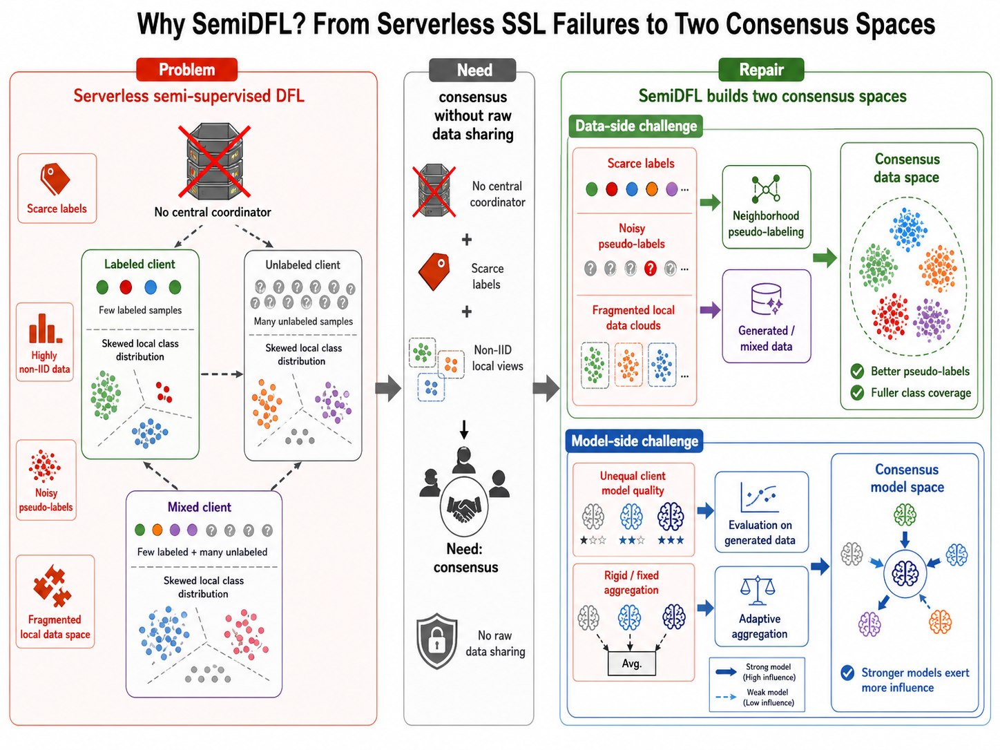
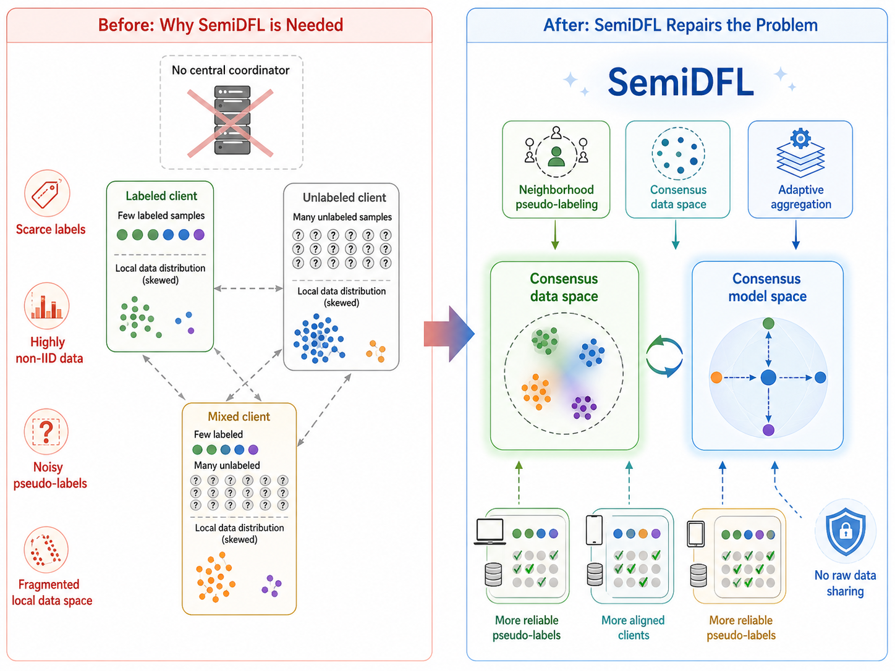
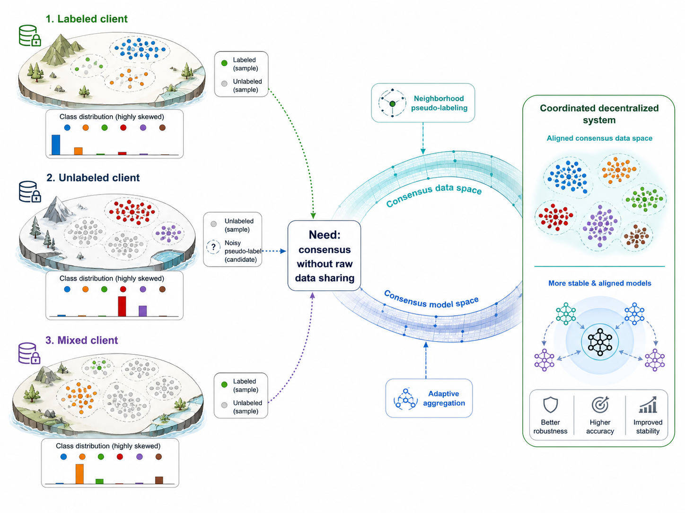
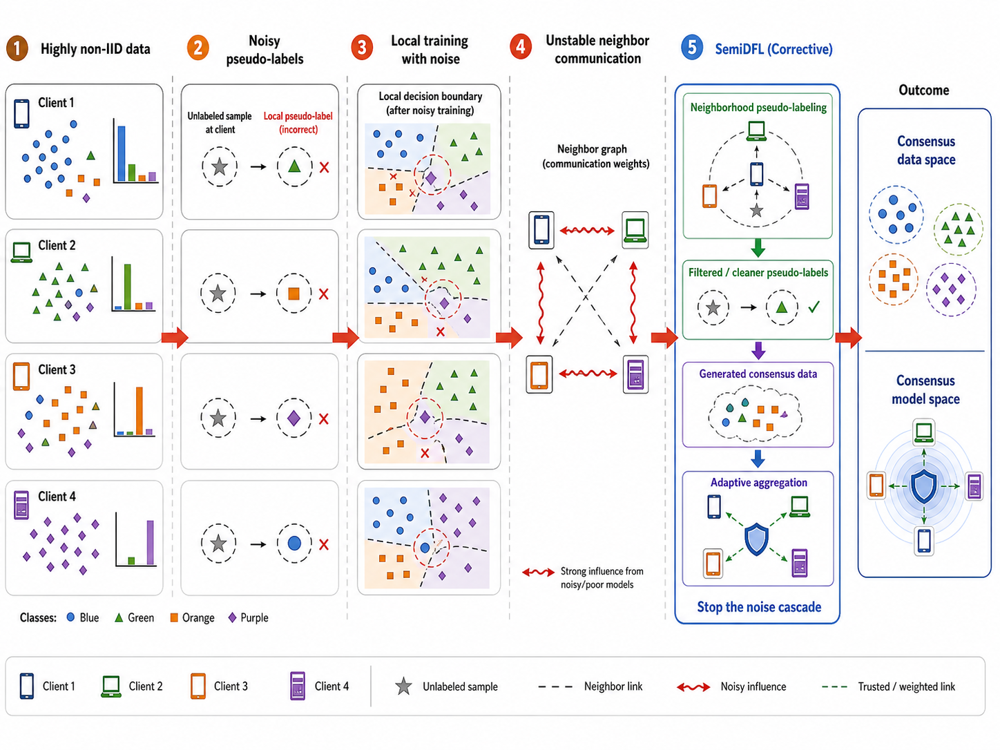
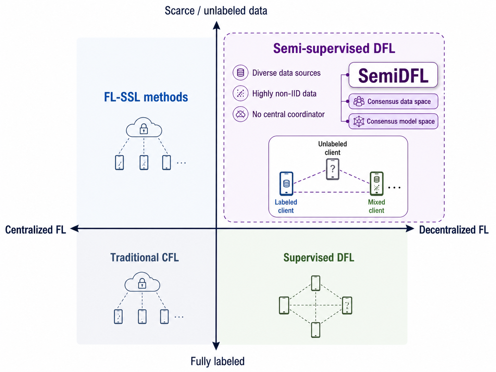
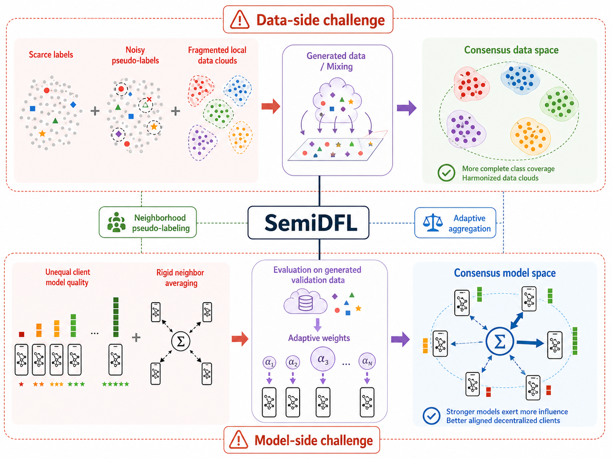
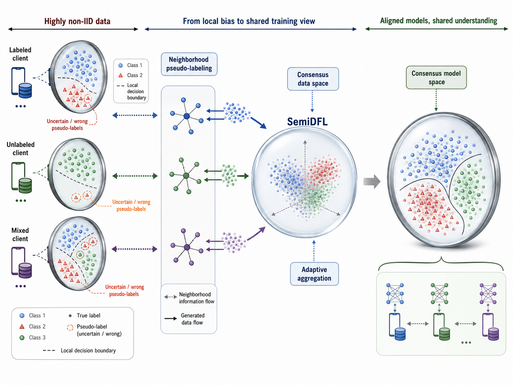

# Inspiration Case Figure Guide

## 中文

`inspiration-case-figure-guide` 是一个用于科研论文启发图、动机图和案例图设计的 Codex/ChatGPT skill。它面向论文开头、方法动机、问题引入、失败案例、before/after 对比、观察到假设推导、场景故事板和 reviewer-facing limitation case 等图形任务，帮助作者把“为什么这项工作值得做”压缩成清晰、可信、可比较的视觉叙事。

### 示例结果图

下面是同系列论文制图 skill 为 SemiDFL 论文生成的最终结果图，用于展示候选图选择和最终图整理后的效果。



### Skill 适合生成的图

- motivating example figure：用一个具体例子暴露研究问题或方法必要性。
- problem-teaser figure：放在论文前部，用来快速说明任务痛点、现有方法不足或关键挑战。
- failure or limitation case：展示已有方法在某些场景下的失败模式、边界条件或局限。
- before/after contrast：对比当前状态与理想状态、baseline 与 proposed method、错误结果与改进结果。
- observation-to-hypothesis diagram：把论文里的关键观察转化为研究假设或设计动机。
- scenario storyboard：用连续场景说明问题如何发生、为何难以解决、方法目标是什么。
- evidence-to-inspiration board：把数据、案例、现象和设计启发组织成一张证据驱动的动机图。
- design-space gap figure：展示现有方法覆盖不到的设计空间、任务区域或能力组合。

### Skill 总结出的分类体系

这个 skill 会从多个角度判断一张 inspiration/case figure 应该如何设计，而不是把所有需求都当成普通流程图或框架图。

- 按论文角色分类：论文引入图、问题 teaser 图、动机案例图、失败模式图、限制说明图、观察解释图、对比图、设计空间缺口图。
- 按动机来源分类：真实案例、失败样例、异常现象、任务冲突、已有方法局限、数据分布差异、用户场景、reviewer 可能质疑的问题。
- 按信息结构分类：案例走查、before/after 对比、问题到目标、观察到假设、证据板、三栏对照、时间线故事板、设计空间定位。
- 按读者问题分类：为什么需要这篇论文、现有方法哪里不够、问题在什么场景中出现、核心观察是什么、方法设计动机从哪里来、这张图应当让 reviewer 记住什么。
- 按视觉叙事分类：从左到右的案例链路、上下分层的因果解释、中心问题扩散、三栏对比、失败到修复、场景到启发、证据到结论。
- 按制图阶段分类：材料 intake、动机诊断、文字候选方向、视觉候选板设置、候选图生成、候选图评审、最终图 brief、正式图生成、caption 和正文说明。
- 按参考图使用方式分类：只参考布局、只参考风格、只参考信息密度、只参考标签组织、只参考配色、只参考局部案例表达。

### 推荐使用方式

优先在 ChatGPT 网页版中使用，并选择 **Extended thinking**。这类图需要理解论文动机、读者预期和案例证据，网页端更适合完成完整的多轮候选图比较和修改。

如果下一步是生成图片，建议在 ChatGPT 网页版中手动切换到 **Create image** 模式，再让 skill 继续生成候选图或正式图。

在 Codex 中也可以使用，但更适合做本地文件整理、skill 修改、说明文档编写和 prompt 包装。真正的图片生成阶段建议优先放在 ChatGPT 网页版或明确可用的图像生成环境中完成。

### ChatGPT 网页版使用步骤

1. 把 `inspiration-case-figure-guide-v3.0.0-skill.zip` 放进 ChatGPT 的 Sources。
2. 把论文 PDF、摘要、引言、方法描述或已有草稿也放进 Sources。
3. 选择 Extended thinking。
4. 输入类似下面的 prompt：

```text
请严格按照 inspiration-case-figure-guide-v3.0.0-skill.zip 里的 workflow，为这篇论文设计一张 inspiration/case figure。请先不要生成图片，先给出启动计划和下一步需要我提供的信息。
```

当 skill 提示进入候选图或正式图生成阶段时，再切换到 **Create image** 模式继续。

### example_semiDFL 示例

`example_semiDFL` 文件夹保存了一次 SemiDFL 论文制图示例。它包含最终结果图、候选图和 ChatGPT 网页版示例记录，可用于理解“先生成多个候选方向，再选择最合适方向继续整理”的工作流。

- `semidfl-chatgpt-example.mhtml`：在 ChatGPT 网页版中使用同系列制图 skill 的示例记录。
- `candidate-1.png` 到 `candidate-6.png`：中间生成的 6 张候选图/选择图。
- `final-result.png`：最后选定并整理后的结果图。

#### Candidate 1



#### Candidate 2



#### Candidate 3



#### Candidate 4



#### Candidate 5



#### Candidate 6



这些候选图用于比较不同的信息组织方式、视觉叙事重点、模块密度和图面表达。最终结果图是在候选方向中选择更合适的一版后继续整理得到的。

### 制图流程

1. 提供论文 PDF、摘要、引言片段、关键失败案例、 motivating example 或已有草稿。
2. 说明目标图位置：论文首页 teaser、introduction figure、motivation figure、method 前置说明、rebuttal 图，或 supplementary case。
3. Skill 先给出启动计划，不在第一轮直接生成图片。
4. Skill 诊断图的核心读者问题：这篇论文为什么必要、现有方法哪里失败、什么案例最能说明问题。
5. Skill 生成 4-6 个文字候选方向，通常默认 6 个。
6. 进入视觉候选板设置，确认每个候选方向的叙事结构、信息密度、参考图属性和图像生成目标。
7. 生成 4-6 张候选图或示意图，默认 6 张，用于比较不同视觉叙事。
8. 选择最接近目标的一张，或指出需要保留、删除、强化和重画的部分。
9. Skill 整理最终图 brief，并进入正式图生成。
10. 最后生成 caption、legend、正文图说明和必要的 reviewer-facing 解释文本。

## English

`inspiration-case-figure-guide` is a Codex/ChatGPT skill for designing inspiration, motivation, and case figures for research papers. It helps authors turn the core reason a paper matters into a clear visual narrative: motivating examples, problem teasers, failure cases, before/after contrasts, observation-to-hypothesis diagrams, scenario storyboards, and reviewer-facing limitation cases.

### Example Result

Below is the final result generated for the SemiDFL paper with a related paper-figure skill. It illustrates the candidate-selection workflow and the polished final output.


### Figure Types

- Motivating example figures that expose a concrete research gap.
- Problem-teaser figures for the paper opening or introduction.
- Failure and limitation cases for existing methods.
- Before/after contrast panels.
- Observation-to-hypothesis diagrams.
- Scenario storyboards.
- Evidence-to-inspiration boards.
- Design-space gap figures.

### Classification Axes Summarized by the Skill

The skill classifies an inspiration or case figure from multiple angles instead of treating every output as a generic diagram.

- By paper role: opening figure, problem teaser, motivation case, failure-mode figure, limitation figure, observation figure, contrast figure, design-space gap figure.
- By motivation source: concrete case, failure example, abnormal observation, task conflict, method limitation, distribution shift, user scenario, reviewer concern.
- By information structure: case walkthrough, before/after contrast, problem-to-goal, observation-to-hypothesis, evidence board, three-column comparison, temporal storyboard, design-space positioning.
- By reader question: why the paper is needed, where existing methods fail, where the problem appears, what observation motivates the work, what the figure should make reviewers remember.
- By visual narrative: left-to-right case chain, layered causal explanation, central problem expansion, three-column contrast, failure-to-fix, scenario-to-insight, evidence-to-conclusion.
- By production stage: material intake, motivation diagnosis, text candidates, visual candidate-board setup, candidate image generation, candidate review, final figure brief, formal generation, caption and paper text.
- By reference-image usage: layout only, style only, information density only, label organization only, color only, or local case expression only.

### Recommended Use

Prefer using this skill in the ChatGPT web app with **Extended thinking** enabled. Inspiration figures depend on paper motivation, case evidence, and reader expectations, so the full workflow benefits from multi-turn reasoning and candidate comparison.

When the next step is image generation, manually switch to **Create image** mode in ChatGPT web before asking the skill to generate candidate figures or the formal figure.

Codex is useful for local file organization, skill editing, documentation, and prompt packaging. For the main image-generation phase, ChatGPT web or another explicitly available image-generation environment is usually the better route.

### ChatGPT Web Usage

1. Add `inspiration-case-figure-guide-v3.0.0-skill.zip` to ChatGPT Sources.
2. Add the paper PDF, abstract, introduction excerpt, method notes, or draft figure notes to Sources.
3. Select Extended thinking.
4. Type a prompt like this:

```text
Please strictly follow the workflow in inspiration-case-figure-guide-v3.0.0-skill.zip to design an inspiration/case figure for this paper. Do not generate images yet; first provide the startup plan and ask for the next required input.
```

Switch to **Create image** mode before continuing into candidate or formal image generation.

### example_semiDFL Example

The `example_semiDFL` folder contains one SemiDFL paper-figure example. It includes the final result, intermediate candidate figures, and a ChatGPT web example record. It shows the workflow of generating multiple visual directions first, then selecting the closest direction for final refinement.

- `semidfl-chatgpt-example.mhtml`: an example record from ChatGPT web.
- `candidate-1.png` to `candidate-6.png`: six intermediate candidate or selection figures.
- `final-result.png`: the selected and polished final result.

#### Candidate 1


#### Candidate 2


#### Candidate 3


#### Candidate 4


#### Candidate 5


#### Candidate 6


These candidate figures are used to compare different information structures, visual narrative priorities, module density, and figure-level expression. The final result is refined from the candidate direction that best fits the paper.

### Figure-Making Workflow

1. Provide the paper PDF, abstract, introduction excerpt, motivating case, failure example, or draft notes.
2. Specify the target figure slot: first-page teaser, introduction figure, motivation figure, pre-method explanation, rebuttal figure, or supplementary case.
3. The skill starts with a text-only startup plan and does not generate images in the first reply.
4. It diagnoses the core reader question: why the paper is necessary, where existing methods fail, and which case best reveals the problem.
5. It proposes 4-6 text directions, usually 6.
6. It sets up a visual candidate board with narrative structure, information density, reference-image attributes, and image-generation goals.
7. It generates 4-6 candidate figures or schematic candidates, usually 6.
8. You select the closest candidate or describe what should be kept, removed, strengthened, or redrawn.
9. The skill prepares the final figure brief and proceeds to formal image generation.
10. It finally drafts the caption, legend, in-paper figure description, and reviewer-facing explanation when needed.
